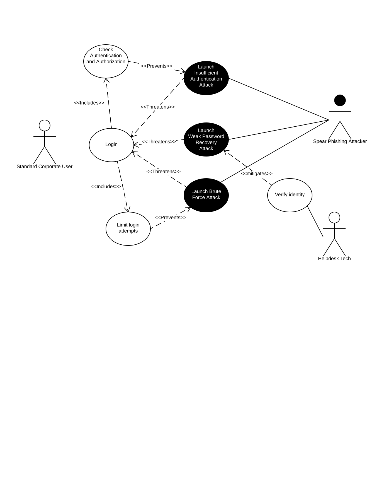

# Requirements for Software Security Engineering

##### [2-3 page report](./Report.md) that describes the following:
* Identify security requirements based on assurance claims
* Document security requirements for the project captured using mis-use case diagrams
* Include links to Lucidchart diagrams with brief descriptions in the document
* Review project documentation for security related configuration and installation

## Project Documentation:
#### Security configuration
* [Initial Configuration](https://www.circl.lu/doc/misp/user-management/)
* [Regular Administration](https://www.circl.lu/doc/misp/administration/)

#### Installation
* [MISP on Ubuntu 16.04](https://github.com/MISP/MISP/blob/2.4/INSTALL/INSTALL.ubuntu1604.txt)
* [MISP on Debian 9](https://github.com/MISP/MISP/blob/2.4/INSTALL/INSTALL.debian9.txt)
* [MISP on CentOS 7](https://github.com/MISP/MISP/blob/2.4/INSTALL/xINSTALL.centos7.txt)

#### Data Leakage

#### Access Control

#### Authentication

#### Common Attacks

#### Fired Employee

